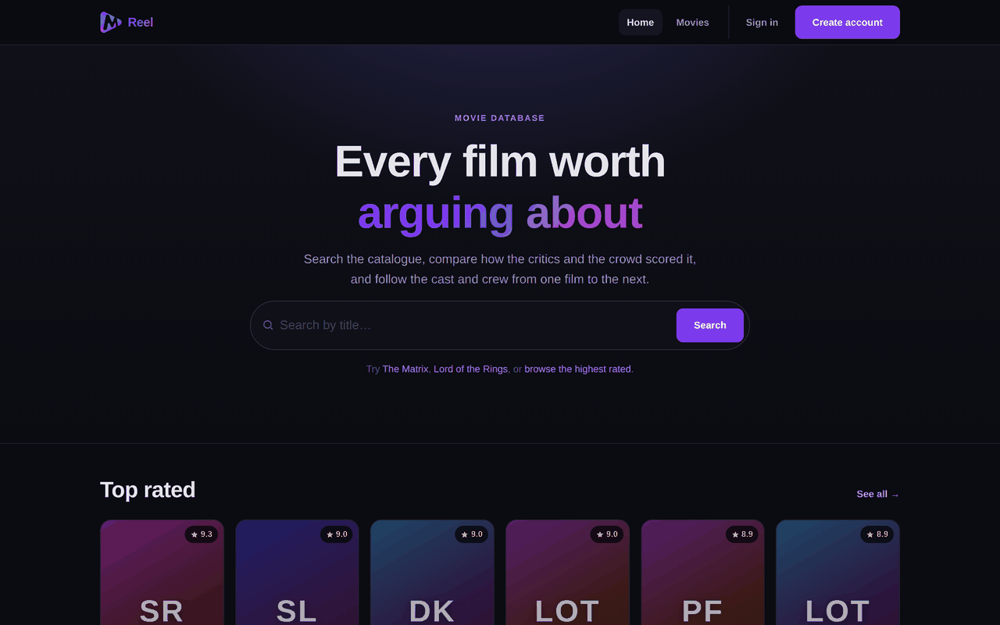
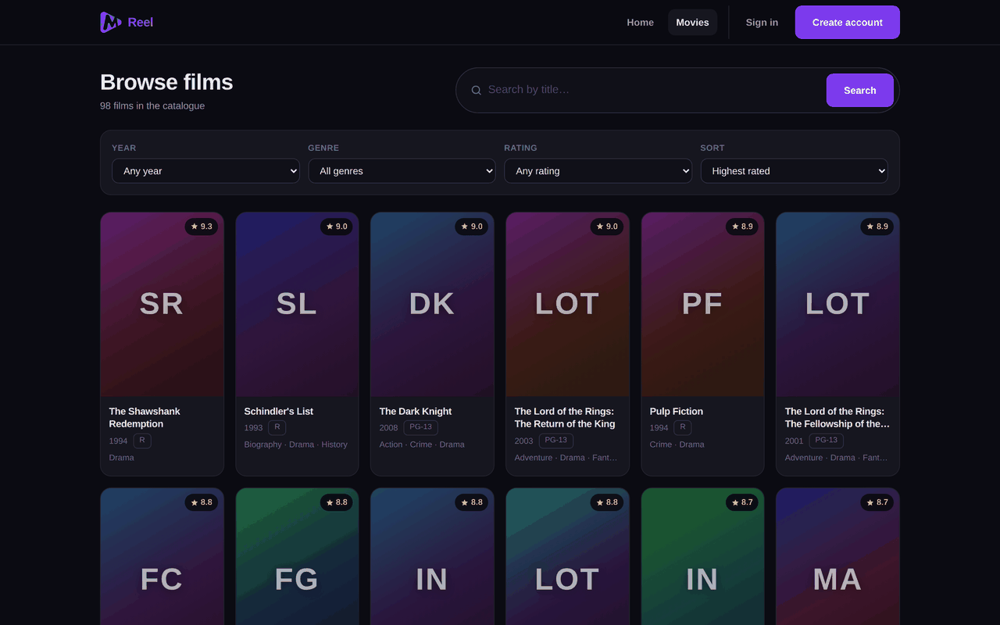
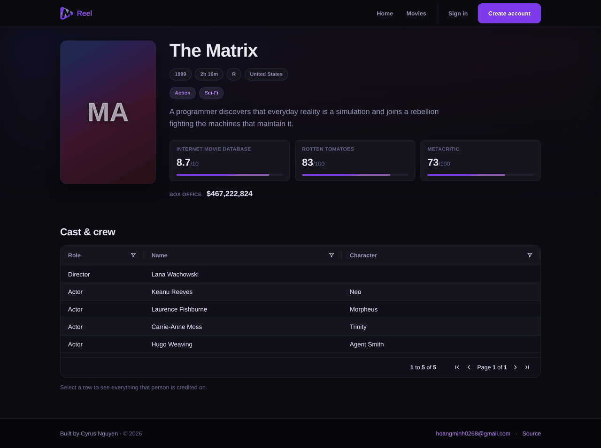
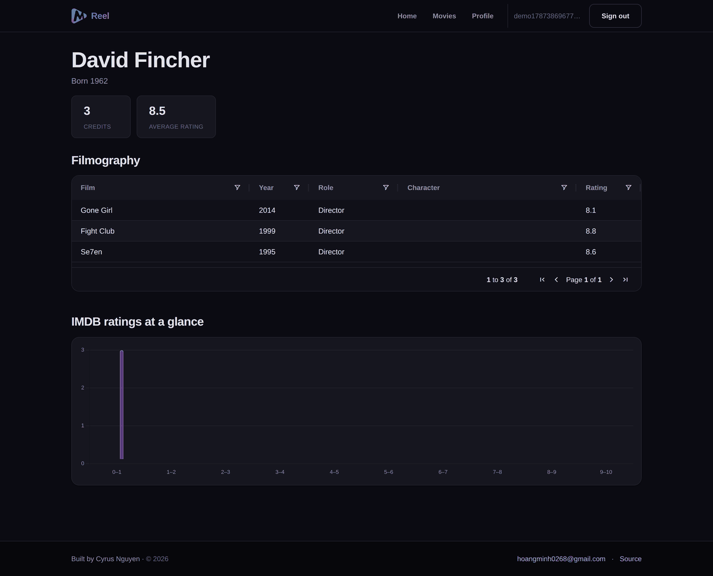
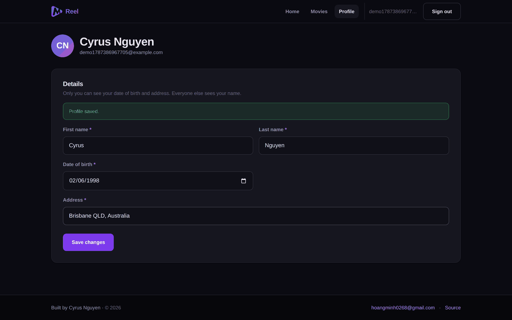
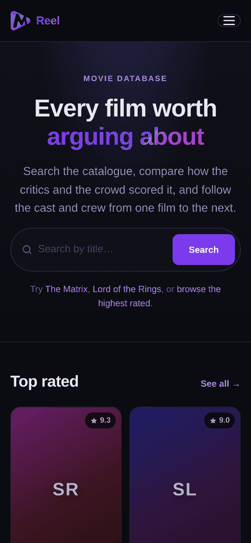
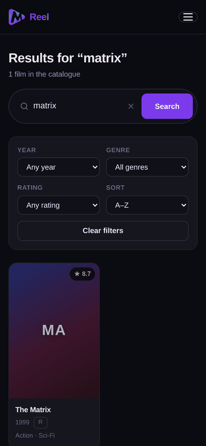

# Reel — Movie Search

React client for the [Movie API](https://github.com/cyrusnguyen/movie-api). Search
a film catalogue, compare ratings from three sources, and follow cast and crew
between titles.

## Screenshots



| Browse and filter | Film detail |
|---|---|
|  |  |

| Person detail | Profile |
|---|---|
|  |  |

<p align="center">
  
  &nbsp;&nbsp;
  
</p>

---

## Quick start

You need the API running first:

```bash
git clone https://github.com/cyrusnguyen/movie-api
cd movie-api && npm install && cp .env.example .env
# add a JWT_SECRET to .env, then:
npm start                      # http://localhost:3000
```

Then this app:

```bash
git clone https://github.com/cyrusnguyen/movie-searching-website
cd movie-searching-website
npm install
cp .env.example .env           # VITE_API_URL defaults to http://localhost:3000
npm run dev                    # http://localhost:5173
```

## Scripts

| Command | Does |
|---|---|
| `npm run dev` | Start the dev server. |
| `npm run build` | Production build into `build/`. |
| `npm run preview` | Serve the production build locally. |
| `npm test` | Run the unit tests. |
| `npm run lint` | Lint the project. |

## Configuration

| Variable | Default | Notes |
|---|---|---|
| `VITE_API_URL` | `http://localhost:3000` | Base URL of the Movie API. |

The API only accepts browser requests from origins in its `CORS_ORIGIN`
allowlist, which defaults to `http://localhost:5173` — this app's dev port.

## Features

- Search by title, with filters for year, genre and minimum rating, plus sorting.
- Poster-card results grid with loading skeletons and real empty and error states.
- Film pages with a rating breakdown, genres, runtime, box office and full credits.
- Person pages with a sortable filmography and a rating distribution chart.
- JWT authentication with automatic, deduplicated token refresh.
- A profile page for the account fields the API has always exposed.
- Keyboard navigable, screen-reader labelled, and responsive from 320px up.

## What changed in the rebuild

### Build

Create React App was deprecated in February 2025 and was the source of
**74 npm advisories (4 critical, 35 high)** that `npm audit fix` could not
resolve. Replaced with Vite 7 and Vitest.

| | Before | After |
|---|---|---|
| npm advisories | 74 | **0** |
| Packages installed | 1518 | 322 |
| Initial JS + CSS (gzip) | ~519 kB | **~29 kB** |
| Production build | ~45 s | ~4 s |

The largest dependencies (ag-grid, chart.js) now load only on the pages that use
them. The bundled logo was a 2861×3045 PNG rendered at 32px — 410 kB for an
icon; it is 8 kB now.

`boostrap@2.0.0` was also removed. That is a typosquat of `bootstrap` (which was
installed alongside it), and npm flags it with a security hold.

### Bugs fixed

- **Registration never worked.** It posted to `${API}/register`, but the API
  mounts that router at `/user`.
- **Token refresh always threw.** `AuthContextProvider` called a hook that read
  `AuthContext` before the provider was mounted, so it received the default
  context value and `setAuthState` was `undefined`.
- **`console("You are not logged in…")`** — `console` is not callable. This threw
  and unmounted the whole app.
- **Sorting and resizing were dead in every table.** `defaultColDef` was an array;
  ag-grid expects an object.
- **The results page could crash** reading `pagination.lastPage` while pagination
  was still `null` — it arrived from a second, separate request.
- **Every search cost two identical network round-trips**, one for rows and one
  for the pagination block.
- **Navigating between two films showed stale data** — the detail effect read
  `id` but declared no dependencies.
- **Film pages crashed on sparse records**, calling `.toLocaleString()` on a null
  box office and `.join()` on absent genres.
- **The registration inputs were uncontrolled** — bound to `state.email.value`
  where `state.email` was a string.
- **The logo linked nowhere** (`as` instead of `tag` on reactstrap's
  `NavbarBrand`) and sign-out was a `Link` with no `to`.
- **A 10.0 rating fell out of the ratings chart**, which indexed a ten-element
  array with `Math.floor(10)`; unrated credits landed in the 0–1 bucket because
  `Number(null)` is `0`.
- **Search broke on `&` or `#`** in a title — the term was interpolated straight
  into the URL.
- The chart re-randomised its colours on every render, so it flickered.
- ~60 lint warnings, including a duplicate object key and an import of
  `IconName` from `react-icons/bi`, which does not exist.

### Security

- **Auth state is derived from the token**, not from an `isAuthenticated` flag in
  `localStorage` that the UI trusted — setting it by hand used to be enough to
  make the app believe you were signed in.
- `jwtDecode` is guarded, so a malformed stored token no longer crashes startup.
- Token refresh is deduplicated, so a burst of requests fires one refresh.
- Route guarding is a real route wrapper rather than an `alert()` and a redirect
  fired as a side effect of a data-fetching effect.

#### XSS and token storage

Tokens live in `localStorage`, which is readable by any script that manages to
run on the page. That is worth being precise about, because the usual advice —
"use httpOnly cookies" — does not fix it: an attacker running script on your
origin does not need to *read* the cookie, since the browser attaches it to
every request they make. httpOnly limits **exfiltration**, not **exploitation**,
and it brings CSRF along as a new problem.

So the defence is layered on stopping script from running at all:

| Layer | Status |
|---|---|
| No injection sinks | No `dangerouslySetInnerHTML`, `innerHTML`, `eval`, `new Function` or `document.write` anywhere in `src/`. React escapes by default; the only `src={}` bindings are `` tags, which cannot execute. |
| Content-Security-Policy | `script-src 'self'` with **no** `'unsafe-inline'` — injected script cannot execute even if a sink appeared. See below. |
| Short-lived credentials | Bearer tokens last 10 minutes; refresh tokens rotate on every use, and replaying a rotated one revokes the whole family. A stolen token is worth minutes and trips the alarm on reuse. |
| Transport | `connect-src` names exactly one API origin, so script cannot post data to an attacker's host. |

Moving to httpOnly cookies is still a reasonable further step, but it is a
smaller improvement than the policy above and is not a substitute for it.

#### The Content-Security-Policy

The policy is **generated at build time** by `csp.js` from `VITE_API_URL`,
rather than hand-written into `vercel.json`. `connect-src` has to name the API's
origin, and hard-coding it in a second place means the two drift apart — a
failure that is silent and total: the deployed app is refused every request to
its own API with nothing in the UI to explain why. Deriving both from one value
makes that impossible.

```
default-src 'self'; script-src 'self'; style-src 'self' 'unsafe-inline';
img-src 'self' data: https:; font-src 'self' data:;
connect-src 'self' <VITE_API_URL origin>;
base-uri 'self'; form-action 'self'; object-src 'none'
```

- `script-src` needs no `'unsafe-inline'` because Vite emits a single external
  module script and no inline ones. That is the whole value of the policy.
- `style-src` does allow inline styles: React `style={{…}}` and ag-grid both set
  style attributes. Inline *styles* can restyle a page, not execute code.
- `base-uri 'self'` matters more than it looks — without it an injected `<base>`
  tag can repoint every relative script URL at another host, walking around
  `script-src 'self'`.
- `frame-ancestors` is set as a real header in `vercel.json`, not here, because
  browsers ignore it in a `<meta>` tag. `vercel.json` also sets `X-Frame-Options`,
  `X-Content-Type-Options`, `Referrer-Policy` and `Permissions-Policy`.

The plugin is build-only. Vite's dev server injects an inline script for hot
module replacement, so enforcing `script-src 'self'` in dev would break
`npm run dev`.

Verified in Chromium under the exact production headers: all pages render with
**zero** CSP violations, ag-grid and chart.js both mount on the detail pages,
the API is reachable, and a probe `fetch` to an unlisted origin is refused.
`src/test/csp.test.js` guards the policy against regressions.

### Design

Rebuilt on a token-based design system (`src/styles/tokens.css`) with a poster
grid, skeleton loading, empty and error states, adaptive tables, visible focus
rings, and a real mobile layout. `reactstrap`, `bootstrap` and
`styled-components` are gone; the styling is plain CSS with custom properties.

Verified end to end in Chromium via Playwright across 20 checks — register,
sign in, search, filter, film, person, profile, sign out, 404 — at 1440px and
375px, with no console errors.

## Deployment

Not currently deployed; the previous Vercel deployment is gone. `vercel.json` is
kept current so it can be redeployed.

```bash
npm run build      # static output in build/
```

**`VITE_API_URL` must be set at build time**, not just at runtime — it is baked
into the bundle *and* into the Content-Security-Policy's `connect-src`. On
Vercel, set it in the project's environment variables and redeploy; building
without it leaves the app pointed at `http://localhost:3000`, which a deployed
browser cannot reach.

Then add the site's origin to the API's allowlist — on Fly that is
`fly secrets set CORS_ORIGIN=https://your-site.vercel.app`, which needs no
rebuild.

The two settings are a pair, in opposite directions: `VITE_API_URL` tells the
site where the API is, and `CORS_ORIGIN` tells the API to accept the site.
